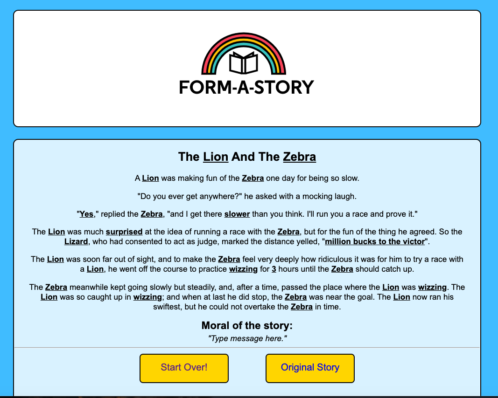

# form-a-story

### **Description:**
This is fun 'Mad Libs' style application meant for entertaining kids. It allows them to input their own personalized verbs, adjectives, animals etc. and create their own fictional story. The app focuses on the proper use of HTML forms, including various input types and buttons, input validation and data utilization using JavaScript logic in order to personally customize a story. The form will also save information previously typed in by the user for later use so they can mix and match elements of the resulting story. As of now, there is only 1 baseline story in which the input is injected into. Future development features would include multiple stories stored as JavaScript Objects which would be chosen at random each time a story form is completed. 
 

_____

### **How to use the App**
* Simply open the app in the browser and begin filling out the form with your own chosen words or select buttons and dropdowns by clicking on them.
* Each input field has placeholder text showing examples of suggested word types. You can either choose from a list of inspirational quotes or create your own! 
* It even includes a moral to the story in which you create! Once finished, click on the 'Form My Story' button in order to view your customized story. 
* You then have a choice to either start over and write a new story or view the original story.   
 

_____

### **Demo Screenshots**
#####Form a Story
* Fill out the provided form information!

* Then submit it to create a customized story!

_________

### **Technologies Used**
* HTML5
* CSS
* JavaScript
 

_____

### **Built With**
* Visual Studio Code
